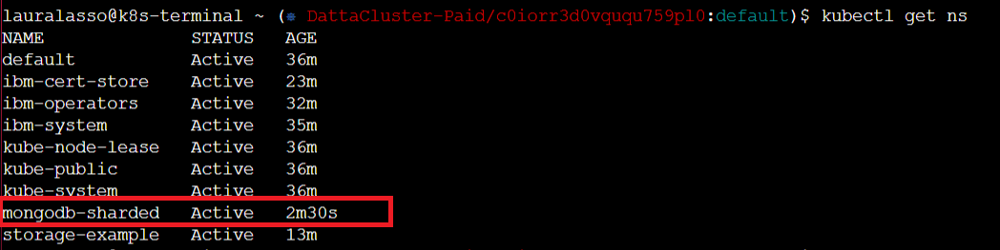

# Install MongoDB Sharded in IBM Cloud

## Pre-requisites

You must have an account created in IBM Cloud. The account needs to either be *Pay-As-You-Go* or *Subscription*. Click [here](https://cloud.ibm.com/docs/account?topic=account-accounts "here") to read more.
If you have a Lite account, you can upgrade it. Click [here](https://cloud.ibm.com/docs/account?topic=account-account-getting-started#account-gs-upgrade "here") to learn how to upgrade.

## Step 1: Provision Kubernetes Cluster

* Click on the search section at the top of the main page, type Kubernetes, and then choose Kubernetes Service.

* In the new window, select between the free and standard type under "Pricing plan". Once selected, click on create.

We'll choose the Standard Plan for this documentation as the Free Plan may fall short of resources when deploying your pods. We highly recommend using a Standard Plan with the hardware that suits you the best. If you're selecting the Standard Plan, please make sure you select the adequate requirements as the following ones are selected as default for the tutorial,

* Select your Kubernetes Version to be the latest available or the required one by your application. In this example, we have set it to be '1.18.13'.
* Select Infrastructure as 'Classic'.
* Leave Resource Group to 'Default'.
* Select Geography to the one that suits you better or that fits your infrastructure.
* Select Availability to be 'Single Zone' or 'Multi Zone' depending on your needs.
* Select a Worker Zone that suits you better or that fits your infrastructure.

* Select the number of workers in Worker Pool. In our case, we'll set it to three (3) as Mongodb-sharded requires it. 
* Give your Worker Pool a name.
* Leave the Encrypt Local Disk option 'On'
* Choose 'Both private and public endpoints' on Master Service Endpoint.

* Give your cluster a name in 'cluster-name'
* Provide the tags to your cluster and click on Create.

Wait a few minutes while your cluster is deployed.

The following checkmark and the word 'normal' will appear once the Kubernetes Cluster is deployed. You can check it under your cluster section which is located in your *Resources List*.

## Step 2:  Deploy IBM Cloud Block Storage plug-in

* Click on the search section at the top of the main page, select IBM Cloud Block Storage, and click on it.

* A new window opens, select the cluster and enter the name you want for this workspace, in this case, it will be called _storage-example_, accept the terms, click *Install* and wait a few minutes.

## Step 3: Verify Installation of Cloud Block Storage plug-in and configuration

* Go to *Resources List* in the Left Navigation Menu and click on *Kubernetes*.

* Click the *Actions* button and select *Web terminal*.

* A window opens to install the web terminal, click on install and wait a few minutes. The window will pop up at the buttom If the web terminal is already installed.

* Once you have installed the terminal, open it, select web terminal, and type the following command. It will show you the workspaces of your cluster. You can see *storage-example* is now active.

`$ kubectl get ns`

* To install MongoDB it is necessary to check that our storage class is in the block storage gold class by default. To verify that the storage class is in default we use the following command. Also, you can follow IBM tutorial on how to change the default class storage [here](https://kubernetes.io/docs/tasks/administer-cluster/change-default-storage-class/ "here"). 

`$ kubectl get storageclass`

* In our example, the storage class is by default in IBM-file-gold, we should change that to the IBM-block-gold to make mongodb-sharded work. To do this we first remove the IBM-file-gold as the default class storage by following this command:

`$ kubectl patch storageclass ibm-file-gold -p '{"metadata": {"annotations":{"storageclass.kubernetes.io/is-default-class":"false"}}}'`

* Check the change is correctly applied. 

`$ kubectl get storageclass`

* Now, mark the IBM-block-gold storage as default by inputting the following command.

`$ kubectl patch storageclass ibmc-block-gold -p '{"metadata": {"annotations":{"storageclass.kubernetes.io/is-default-class":"false"}}}'`

`$ kubectl get storageclass`

## Step 4: Install MongoDB Sharded

* Click on the search section at the top of the main page, type Redis, and click on _MongoDB(R) Sharded packaged by Bitnami_.

* A new window opens, select the cluster and enter the name you want for the Redis workspace or select an exist workspace, in this case, we'll create a new one and it will be called _mongodb-sharded_, accept the terms and click on *Install*. You can modify the different installation parameters at the bottom. We will leave them by default as shown below, but you can read more about setting up the parameters [here](https://cloud.ibm.com/catalog/content/mongodb-sharded-Qml0bmFtaS1tb25nb2RiLXNoYXJkZWQ=-global#about "here").

* You can modify the different installation parameters at the bottom. We will leave them by default except for the root password, which you will need to access your MongoDB console and work with your databases.

Make sure you set up a password in the _mongodbRootPassword_ variable. 

## Step 4: Verify Installation MongoDB Sharded

* Open the web terminal and type the following command. You can see *mongodb-sharded* is now active.

`$ kubectl get ns`

* You can then obtain more data about the service and it's pods.

`$ kubectl get pod -n NAMESERVICE -o wide`

`$ kubectl get service -n NAME SERVICE`

* Select the master pod within your service using bash.

`$ kubectl exec --stdin --tty PODNAME -n NAMESPACE -- /bin/bash`

* Check if MongoDB Sharded is correctly installed by checking the server version or using any of the MongoDB commands.

` mongod --version `

` mongod --h `

You have finished the installation, enjoy your MongoDB Sharded installation!

